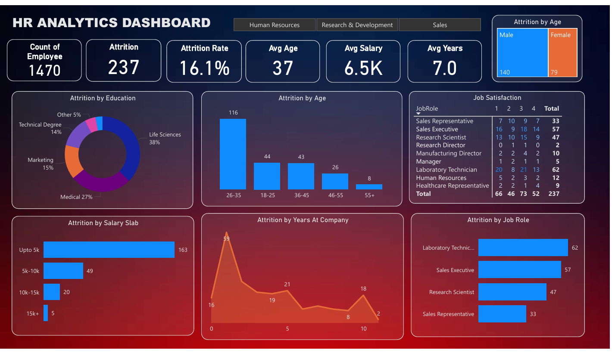

# HR Analytics Dashboard using Power BI

## 📌 Project Description
This project is an HR Analytics Dashboard developed using Power BI.  
It helps analyze employee attrition, age distribution, salary slabs, job roles, and job satisfaction to support data-driven HR decisions.

---

## 🎯 Objectives
- To calculate and analyze employee attrition rate  
- To identify factors affecting employee attrition  
- To visualize workforce data using interactive dashboards  
- To help HR teams improve employee retention strategies  

---

## 🛠 Tools & Technologies Used
- Power BI Desktop  
- Excel / CSV Dataset  
- GitHub for project hosting  

## 📊 Dashboard Preview

## 📁 Dataset Information
The dataset contains employee-related information such as age, gender, education, job role, salary, years at company, and attrition status.  
Data preprocessing and cleaning were performed before visualization.

## 🔍 Key Insights
- Overall employee attrition rate is **16.1%**
- Highest attrition observed in the **26–35 age group**
- Employees with **lower salary slabs** show higher attrition
- **Laboratory Technicians** and **Sales Executives** have the highest attrition
- Job satisfaction impacts employee retention significantly

---

## 📂 Files Included
- `HR_Analytics.pbix` – Power BI project file  
- `HR_Analytics_Dashboard.png` – Dashboard image preview  
- `README.md` – Project documentation  

---

## 🌐 Live Dashboard 
The live dashboard link can be accessed below:  
[https://app.powerbi.com/xxxxx
](https://app.powerbi.com/groups/me/reports/2b30d00e-879d-42e2-a059-df524d22f328/9c585a55445295d91582?experience=power-bi)
---

##  Conclusion
This HR Analytics Dashboard provides meaningful insights into employee attrition and workforce trends.  
It helps organizations make informed HR decisions and improve employee satisfaction and retention.

---

## 👩‍💻 Author
**Swati**  

